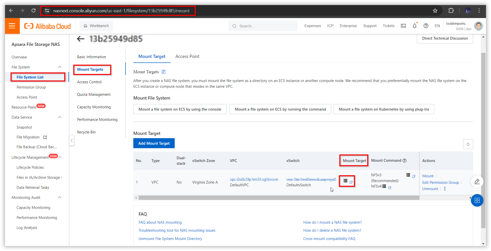
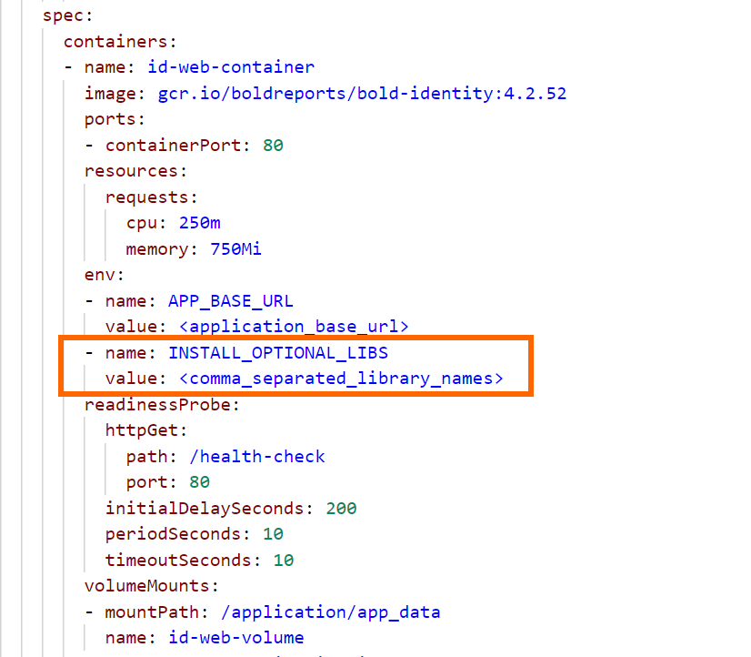
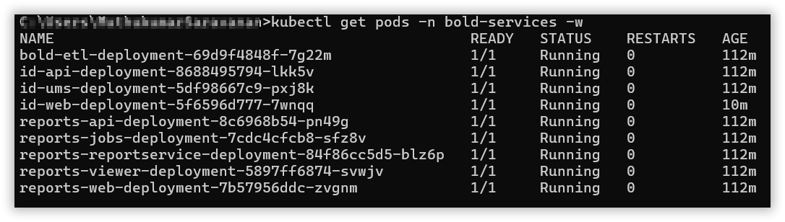

# Deploying Bold Reports in Alibaba Cloud Kubernetes (ACK) Cluster

This section provides instructions on how to deploy Bold Reports in an Alibaba Cloud Kubernetes (ACK) cluster. Please follow the documentation below to successfully deploy these applications.

# Deploy Bold Reports using Kubectl

The following steps will guide you through the process of deploying Bold Reports using Kubectl in an Alibaba Cloud Kubernetes (ACK) cluster.

## Deployment prerequisites

The following requirements are necessary to deploy the Bold Reports solution using Kubectl:

* [Install Kubectl](https://kubernetes.io/docs/tasks/tools/#kubectl): Make sure you install kubectl on your local machine to facilitate the deployment process.
* [NAS File System](./pre-requisites.md#ack-file-system): Set up a NAS file system to store the required data for Bold Reports.
* [Create and connect a ACK cluster](./pre-requisites.md#ack-cluster): Create and connect an ACK cluster in Alibaba Cloud that will host Bold Reports deployment.
* Load Balancing- [Nginx](https://kubernetes.github.io/ingress-nginx/deploy/) : By default, an Alibaba Cloud Kubernetes (ACK) cluster has Nginx already installed in the kube-system namespace, so there is no need to install it manually. The Nginx Ingress Controller is available and can be utilized to enable load balancing for your Bold Reports deployment.

Please ensure that you have fulfilled these prerequisites before proceeding with the deployment.

# Bold Reports on Alibaba Cloud Container Service for Kubernetes

For fresh installation, continue with the following steps to deploy Bold Reports On-Premise in Alibaba Cloud Kubernetes Service (ACK).

1. Download the following files for Bold Reports deployment in ACK:

    * [namespace.yaml](https://raw.githubusercontent.com/boldreports/bold-reports-kubernetes/v10.1.11/deploy/namespace.yaml)
    * [log4net_config.yaml](https://raw.githubusercontent.com/boldreports/bold-reports-kubernetes/v10.1.11/deploy/log4net_config.yaml)
    * [pvclaim_ack.yaml](https://raw.githubusercontent.com/boldreports/bold-reports-kubernetes/v10.1.11/deploy/pvclaim_ack.yaml)
    * [deployment.yaml](https://raw.githubusercontent.com/boldreports/bold-reports-kubernetes/v10.1.11/deploy/deployment.yaml)
    * [hpa.yaml](https://raw.githubusercontent.com/boldreports/bold-reports-kubernetes/v10.1.11/deploy/hpa.yaml)
    * [service.yaml](https://raw.githubusercontent.com/boldreports/bold-reports-kubernetes/v10.1.11/deploy/service.yaml)
    * [ingress.yaml](https://raw.githubusercontent.com/boldreports/bold-reports-kubernetes/v10.1.11/deploy/ingress.yaml)
2. Navigate to the folder where the deployment files were downloaded in Step 1.
3. Follow the documentation provided at [this link](https://www.alibabacloud.com/help/en/nas/latest/create-a-nas-file-system) to create a `file system` in Alibaba Cloud.
4. Once the file system is created, locate and click on the cube icon. This will allow you to view the mount target hostname. Take note of the mount target hostname, as you will need it for mounting the file system with our application.

   
   
5. Open the `pvclaim_ack.yaml` file and replace the `<host_name_of_mount_target>` placeholder with the actual mount target hostname noted in the previous step.

   

6. Connect with your Alibaba ACK cluster
7. After connecting with your cluster, deploy the latest Nginx ingress controller to your cluster using the following command.

```sh
kubectl apply -f https://raw.githubusercontent.com/kubernetes/ingress-nginx/controller-v1.2.0/deploy/static/provider/cloud/deploy.yaml
```
8. Navigate to the folder where the deployment files were downloaded from **Step 1**.
9.Run the following command to create the namespace for deploying Bold Reports.

```sh
kubectl apply -f namespace.yaml
```
10. Run the following command to create the configmap.

```sh
kubectl apply -f log4net_config.yaml
```
11. If you have a DNS to map with the application, then you can continue with the following steps, else skip to **Step 15**. 

12. Open the **ingress.yaml** file. Uncomment the host value and replace your DNS hostname with `example.com` and save the file.

13. If you have the SSL certificate for your DNS and need to configure the site with your SSL certificate, follow the below step or you can skip to **Step 15**.

14. Run the following command to create a TLS secret with your SSL certificate.

```sh
kubectl create secret tls boldreports-tls -n bold-services --key <key-path> --cert <certificate-path>
```

15. Now, uncomment the `tls` section and replace your DNS hostname with `example.com` in ingress spec and save the file.


16. Run the following command for applying the Bold Reports ingress to get the IP address of Nginx ingress.

```sh
kubectl apply -f ingress.yaml
```

17. Now, run the following command to get the ingress IP address.

```sh
kubectl get ingress -n bold-services
```
Repeat the above command till you get the IP address in ADDRESS tab as shown in the following image.
 

18. Note the ingress IP address and map it with your DNS, if you have added the DNS in **ingress.yaml** file. If you do not have the DNS and want to use the application, then you can use the ingress IP address.

19. Open the **deployment.yaml** file from the downloaded files in **Step 1**. Replace your DNS or ingress IP address in `<application_base_url>` place.
    
    Ex: `http://example.com`, `https://example.com`, `http://<ingress_ip_address>`

     
	
20. Read the optional client library license agreement from the following link.
    
    [Consent to deploy client libraries](../docs/consent-to-deploy-client-libraries.md)
	
21. Note the optional client libraries from the above link as comma separated names and replace it in `<comma_separated_library_names>` place. Save the file after the required values has been replaced.

 

22. Now, run the following commands one by one:

```sh
kubectl apply -f pvclaim_aks.yaml
```

```sh
kubectl apply -f deployment.yaml
```

```sh
kubectl apply -f hpa.yaml
```

```sh
kubectl apply -f service.yaml
```

23. Wait for some time till the Bold Reports On-Premise application deployed to your Microsoft AKS cluster.

24. Use the following command to get the pods’ status.

```sh
kubectl get pods -n bold-services
```
 

25. Wait till you see the applications in running state. Then use your DNS or ingress IP address you got from **Step 16** to access the application in the browser.

26.	Configure the Bold Reports On-Premise application startup to use the application. Please refer the following link for more details on configuring the application startup.
    
    https://help.boldreports.com/enterprise-reporting/administrator-guide/application-startup/


