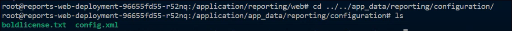

# Enable Puppeteer when upgrade to 5.4.20

> **Important:** Puppeteer are necessary to achieve `image and PDF export` functionalities in reports,schedules from Bold Reports. Without these packages, the image and PDF export options in reports and schedules will no longer be available.

1. Please run the below command for bash into your pod for enable the Puppeteer in reporting config.xml:

    ```sh
    kubectl exec -it <reports-web_Deployment_Name> -n <your_namespace> -- bash
    ```
2. Navigate to the following directory

    ```sh
    application/app_data/configuration/reporting
    ```
    


3. Edit the config.xml file by using below command.

    ```sh
        nano config.xml
    ```

3. Add the following line on the config file to enable the puppeteer, save the changes and exit from the bash command.

    ```sh
    <Exporting UsePuppeteer="true" PuppeteerPath=""></Exporting>
    ```
    


4. Restart the report services by using given commands,

Mulitple-Container:

    ```sh
    kubectl rollout restart deployment/reports-api-deployment -n {your_namespace}
    kubectl rollout restart deployment/reports-jobs-deployment -n {your_namespace}
    kubectl rollout restart deployment/reports-web-deployment -n {your_namespace}
    kubectl rollout restart deployment/reports-reportservice-deployment -n {your_namespace}
    kubectl rollout restart deployment/reports-viewer-deployment -n {your_namespace}
    ```