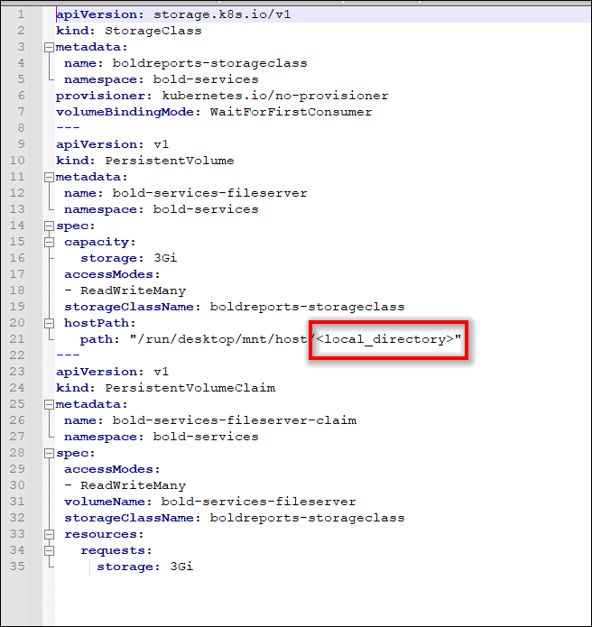

# Bold Reports on On-Premise Kubernetes Cluster

For fresh installation, continue with the following steps to deploy Bold Reports application in your On-Premise machine kubernetes cluster.

1. Download the following files for Bold Reports deployment in On-Premise.

    * `namespace.yaml`
    * `pvclaim_onpremise.yaml`
    * `deployment.yaml`
    * `hpa.yaml`
    * `service.yaml`
    * `ingress.yaml`    
    
2. Create a folder in your machine to store the shared folders for applications usage.

   Ex: `D://app/shared`

3. Open **pvclaim_onpremise.yaml** file, downloaded in **Step 1** .Replace the shared folder path in your host machine to the `<local_directory>` place in the file. You can also change the storage size in the YAML file.

    Ex: D://app/shared -> /run/desktop/mnt/host/**d/app/shared**
    
    

4. Deploy the latest Nginx ingress controller to your cluster using the following command.

    ```sh
    kubectl apply -f https://raw.githubusercontent.com/kubernetes/ingress-nginx/controller-v0.41.2/deploy/static/provider/cloud/deploy.yaml
    ```

5. Map the DNS to your machine IP address, in which you want to access the application.

6. Navigate to the folder where the deployment files were downloaded from Step 1.

7. Run the following command to create the namespace for deploying Bold Reports.

    ```sh
    kubectl apply -f namespace.yaml
    ```

8. Open the **ingress.yaml** file. Uncomment the host value and replace your DNS hostname with `example.com` and save the file.

9. If you have the SSL certificate for your DNS and need to configure the site with your SSL certificate, run the following command to create a TLS secret with your SSL certificate.

    ```sh
   kubectl create secret tls boldreports-tls -n bold-services --key <key-path> --cert <certificate-path>
    ```

10. Now, uncomment the `tls` section and replace your DNS hostname with `example.com` in ingress spec and save the file.

    

11. Open the **deployment.yaml** file from the downloaded files in **Step 1**. Replace your DNS in `<application_base_url>` place.
    
    Ex: `http://example.com`, `https://example.com`

    

12. Now, run the following commands one by one:

    ```sh
    kubectl apply -f pvclaim_onpremise.yaml
    ```

    ```sh
    kubectl apply -f deployment.yaml
    ```

    ```sh
    kubectl apply -f hpa.yaml
    ```

    ```sh
    kubectl apply -f service.yaml
    ```

    ```sh
    kubectl apply -f ingress.yaml
    ```

13. Wait for some time till the Bold Reports On-Premise application deployed to your On-Premise Kubernetes cluster.

14. Use the following command to get the pods status.

     ```sh
    kubectl get pods -n bold-services
    ```    
    

15. Use your DNS hostname to access the application in the browser.

16. Configure the Bold Reports On-Premise application startup to use the application. Please refer the following link for more details on configuring the application startup.

    https://help.boldreports.com/enterprise-reporting/administrator-guide/application-startup/