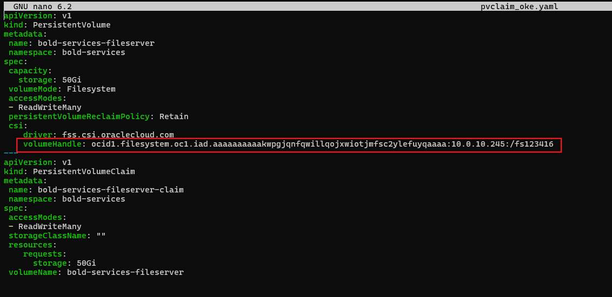
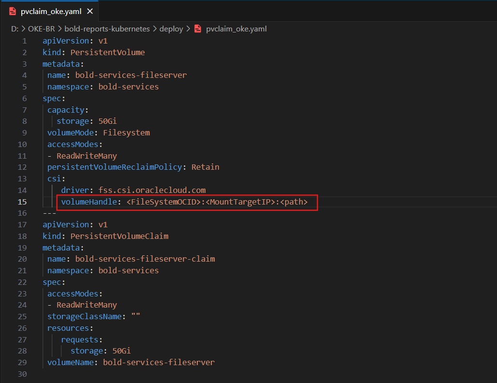
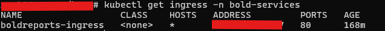
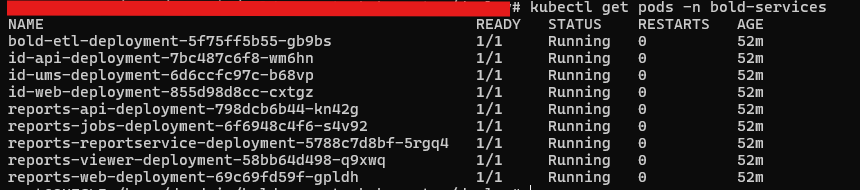

# Bold Reports on Microsoft Oracle Kubernetes Engine.

For fresh installation, continue with the following steps to deploy Bold Reports On-Premise in Microsoft Oracle Kubernetes Engine (OKE).

1. Download the following files for Bold Reports deployment in OKE:

    * [namespace.yaml](https://raw.githubusercontent.com/boldreports/bold-reports-kubernetes/v11.1.10/deploy/namespace.yaml)
    * [log4net_config.yaml](https://raw.githubusercontent.com/boldreports/bold-reports-kubernetes/v11.1.10/deploy/log4net_config.yaml)
    * [pvclaim_oke.yaml](https://raw.githubusercontent.com/boldreports/bold-reports-kubernetes/v11.1.10/deploy/pvclaim_oke.yaml)
    * [deployment.yaml](https://raw.githubusercontent.com/boldreports/bold-reports-kubernetes/v11.1.10/deploy/deployment.yaml)
    * [hpa.yaml](https://raw.githubusercontent.com/boldreports/bold-reports-kubernetes/v11.1.10/deploy/hpa.yaml)
    * [service.yaml](https://raw.githubusercontent.com/boldreports/bold-reports-kubernetes/v11.1.10/deploy/service.yaml)
    * [ingress.yaml](https://raw.githubusercontent.com/boldreports/bold-reports-kubernetes/v11.1.10/deploy/ingress.yaml)

2. Create a Kubernetes cluster in Oracle Cloud Infrastructure Container Engine for Kubernetes (OKE) to deploy Bold Reports.

	https://www.oracle.com/webfolder/technetwork/tutorials/obe/oci/oke-full/index.html#DefineClusterDetails

3. Create a File System volume by following the link below to store the Bold Reports application data.

    https://docs.oracle.com/en-us/iaas/compute-cloud-at-customer/topics/file/creating-a-file-system-mount-target-and-export.htm

4. Note the File System OCID, Mount Target IP, and Export Path to store the shared folders for application usage.
	
	
	
5. Open **pvclaim_oke.yaml** file, downloaded in **Step 1**. Update the volumeHandle value to `<FileSystemOCID>:<MountTargetIP>:<path>`

    

     Where:
    - `<FileSystemOCID>` is the OCID of the file system defined in the File Storage service.
    - `<MountTargetIP>` is the IP address assigned to the mount target.
    - `<path>` is the mount path to the file system relative to the mount target IP address, starting with a slash. For example: `ocid1.filesystem.oc1.iad.aaaa______j2xw:10.0.0.6:/FileSystem1`


6. Connect with your Microsoft OKE cluster.

7. After connecting with your cluster, deploy the latest Nginx ingress controller to your cluster using the following command.

```sh
kubectl apply -f https://raw.githubusercontent.com/kubernetes/ingress-nginx/controller-v1.2.0/deploy/static/provider/cloud/deploy.yaml
```

8. Navigate to the folder where the deployment files were downloaded from **Step 1**.

9. Run the following command to create the namespace for deploying Bold Reports.

```sh
kubectl apply -f namespace.yaml
```

10. Run the following command to create the configmap.

```sh
kubectl apply -f log4net_config.yaml
```

11. If you have a DNS to map with the application, then you can continue with the following steps, else skip to **Step 15**. 

12. Open the **ingress.yaml** file. Uncomment the host value and replace your DNS hostname with `example.com` and save the file.

13. If you have the SSL certificate for your DNS and need to configure the site with your SSL certificate, follow the below step or you can skip to **Step 15**.

14. Run the following command to create a TLS secret with your SSL certificate.

```sh
kubectl create secret tls boldreports-tls -n bold-services --key <key-path> --cert <certificate-path>
```

15. Now, uncomment the `tls` section and replace your DNS hostname with `example.com` in ingress spec and save the file.

    

16. Run the following command for applying the Bold Reports ingress to get the IP address of Nginx ingress.

```sh
kubectl apply -f ingress.yaml
```

17. Now, run the following command to get the ingress IP address.

```sh
kubectl get ingress -n bold-services
```
Repeat the above command till you get the IP address in ADDRESS tab as shown in the following image.

 

18. Note the ingress IP address and map it with your DNS, if you have added the DNS in **ingress.yaml** file. If you do not have the DNS and want to use the application, then you can use the ingress IP address.

19. Open the **deployment.yaml** file from the downloaded files in **Step 1**. Replace your DNS or ingress IP address in `<application_base_url>` place.
    
    Ex: `http://example.com`, `https://example.com`, `http://<ingress_ip_address>`

     
	
20. Read the optional client library license agreement from the following link.
    
    [Consent to deploy client libraries](../docs/consent-to-deploy-client-libraries.md)
	
21. Note the optional client libraries from the above link as comma separated names and replace it in `<comma_separated_library_names>` place. Save the file after the required values has been replaced.

     

22. Now, run the following commands one by one:

```sh
kubectl apply -f pvclaim_oke.yaml
```

```sh
kubectl apply -f deployment.yaml
```

```sh
kubectl apply -f hpa.yaml
```

```sh
kubectl apply -f service.yaml
```

23. Wait for some time till the Bold Reports On-Premise application deployed to your Microsoft OKE cluster.

24. Use the following command to get the pods’ status.

```sh
kubectl get pods -n bold-services
```
 

25. Wait till you see the applications in running state. Then use your DNS or ingress IP address you got from **Step 16** to access the application in the browser.

26.	Configure the Bold Reports On-Premise application startup to use the application. Please refer the following link for more details on configuring the application startup.
    
    https://help.boldreports.com/enterprise-reporting/administrator-guide/application-startup/