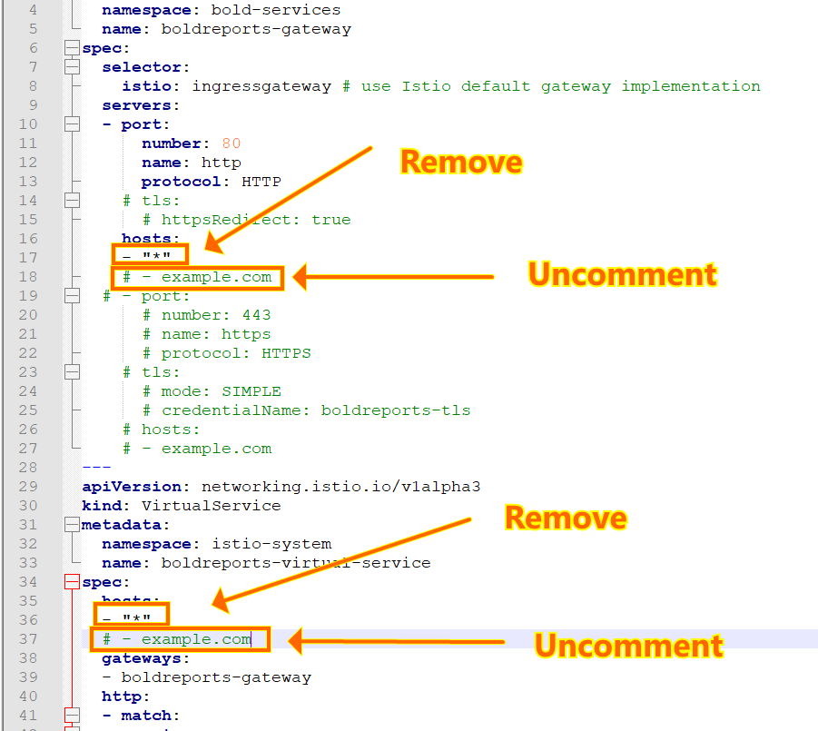
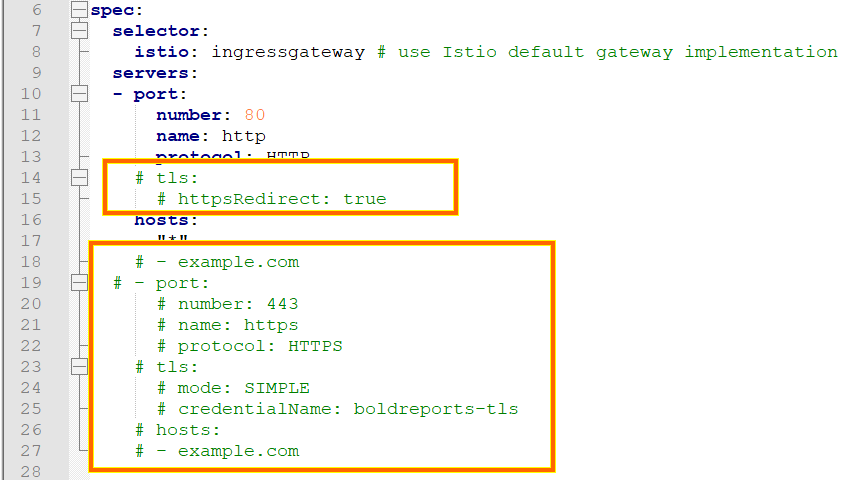

# Bold Reports on Google Kubernetes Engine

For fresh installation, continue with the following steps to deploy Bold Reports On-Premise in Google Kubernetes Engine (GKE).

1. Download the following files for Bold Reports deployment in GKE:

    * [namespace.yaml](https://raw.githubusercontent.com/boldreports/bold-reports-kubernetes/v6.1.34/deploy/namespace.yaml)
    * [log4net_config.yaml](https://raw.githubusercontent.com/boldreports/bold-reports-kubernetes/v6.1.34/deploy/log4net_config.yaml)
    * [pvclaim_gke.yaml](https://raw.githubusercontent.com/boldreports/bold-reports-kubernetes/v6.1.34/deploy/pvclaim_gke.yaml)
    * [deployment.yaml](https://raw.githubusercontent.com/boldreports/bold-reports-kubernetes/v6.1.34/deploy/deployment.yaml)
    * [hpa_gke.yaml](https://raw.githubusercontent.com/boldreports/bold-reports-kubernetes/v6.1.34/deploy/hpa_gke.yaml)
    * [service.yaml](https://raw.githubusercontent.com/boldreports/bold-reports-kubernetes/v6.1.34/deploy/service.yaml)
    * [istio_gateway.yaml](https://raw.githubusercontent.com/boldreports/bold-reports-kubernetes/v6.1.34/deploy/istio_gateway.yaml)
    * [destination_rule.yaml](https://raw.githubusercontent.com/boldreports/bold-reports-kubernetes/v6.1.34/deploy/destination_rule.yaml)

2. Create a Kubernetes cluster in Google Cloud Platform (GCP) to deploy Bold Reports.

   https://console.cloud.google.com/kubernetes 

3. Create a Google filestore instance to store the shared folders for application usage.

   https://console.cloud.google.com/filestore 

4. Note the **File share name** and **IP address** after creating filestore instance.


5. Open **pvclaim_gke.yaml** file, downloaded in **Step 1**. Replace the **File share name** and **IP address** noted in above step to the `<file_share_name>` and `<file_share_ip_address>` places in the file. You can also change the storage size in the YAML file. Save the file once you replaced the file share name and file share IP address.


6. Connect with your GKE cluster.

   https://cloud.google.com/kubernetes-engine/docs/quickstart

7. Install istio ingress gateway in your GKE cluster by following the below link,
https://istio.io/v1.2/docs/setup/kubernetes/install/platform/gke/

8.	Wait and get istio ingress gateway externa IP using the following command.

```sh
kubectl -n istio-system get service istio-ingressgateway -o 
jsonpath='{.status.loadBalancer.ingress[0].ip}'.
```

9. If you have a DNS to map with the application, then you can continue with the following steps, else skip to Step 16. If you do not have the DNS and want to use the application, then you can use the istio ingress gateway externa IP address which you got from above step.

10.	Map istio ingress gateway external ip to your DNS record.

11.	Open **istio_gateway.yaml** file downloaded from **Step 1**.

12.	Remove the line * from hosts, uncomment the next line and replace your DNS hostname with example.com and save the file.

 

13. If you have the SSL certificate for your DNS and need to configure the site with your SSL certificate, follow the below step or you can skip to **Step 16**.

14. Run the following command to create a TLS secret with your SSL certificate.

```sh
kubectl create secret tls boldreports-tls -n bold-services --key <key-path> --cert <certificate-path>
```

15.	Now, uncomment the following section in istio_gateway.yaml file and replace your DNS hostname with example.com and save the file.

 

16. Open the **deployment.yaml** file from the downloaded files in **Step 1**. Replace your DNS or istio ingress gateway externa IP address in `<application_base_url>` place.
    
    Ex:  `http://example.com`, `https://example.com`, `http://<istio_ingress_gateway_externa_IP_address>`

     

17. Read the optional client library license agreement from the following link.

    [Consent to deploy client libraries](../docs/consent-to-deploy-client-libraries.md)

18. Note the optional client libraries from the above link as comma separated names and replace it in `<comma_separated_library_names>` place. Save the file after the required values has been replaced.

     

19.	Now, run the following commands one by one:

```sh
kubectl apply -f pvclaim_gke.yaml
```

```sh
kubectl apply -f deployment.yaml
```

```sh
kubectl apply -f hpa_gke.yaml
```

```sh
kubectl apply -f service.yaml
```

```sh
kubectl apply -f istio_gateway.yaml
```

```sh
kubectl apply -f destination_rule.yaml
```

20. If you face any error while applying the hpa.yaml, try to use hpa_gke.yaml. The hpa_gke.yaml does not contain scaledown behavior which will not support in some clusters.

21.	Wait for some time till the Bold Reports On-Premise application deployed to your Google Kubernetes cluster.

22.	Use the following command to get the pods status.

```sh
kubectl get pods -n bold-services
```
 

23. Wait till you see the applications in running state. Then, use your DNS or ingress IP address you got from **Step 16** to access the application in the browser.

24.	Configure the Bold Reports On-Premise application startup to use the application. Please refer the following link for more details on configuring the application startup.
    
    https://help.boldreports.com/enterprise-reporting/administrator-guide/application-startup/
